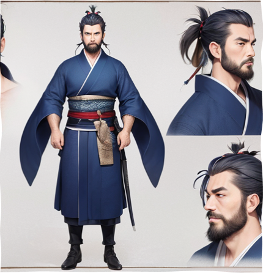
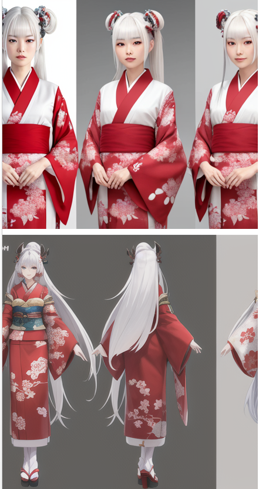
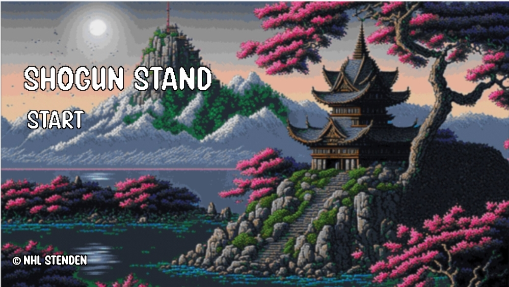
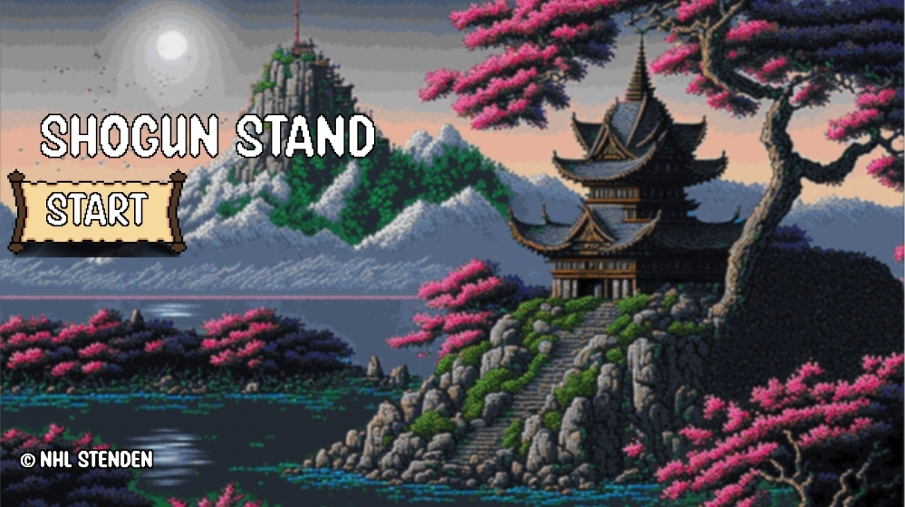

<h2> Shogun Stand </h2>

<h3> Introduction </h3>

In 16th century Japan during the Sengoku period, Daimyo X was a powerful lord tasked with stopping a skilled general named Sei Shapu and his army from conquering his castle. X's forces prepared for battle, knowing that failure would result in the execution of X's fiancee Yumi. After fighting over 100 waves of enemies, Taro emerged victorious and rescued Yumi. The shogun had no choice but to release her unharmed, and X married her in a grand wedding. Taro was hailed as a hero among his people for his bravery and cunning.

<h3> Game Concept </h3>
Shogun Stand is a 2D tower defense game that offers engaging gameplay mechanics deeply rooted in Japanese mythology. Players will strategically build, upgrade, and deploy various attack units inspired by historical Japanese warriors, such as samurai, archers, and ninjas, to fend off waves of mythical enemies including Yokai, Oni, and Tengu.

The game is based on the arcade style, that means if the player's health is 0 then he has to start the game all over again.

The game features a diverse array of defense towers, each with unique abilities that can be enhanced through a skill tree system.

Players must carefully select the optimal combination of units and towers to exploit enemy weaknesses and synergize with their own strategy.

During gameplay, players will face intense boss fights that challenge their tactical skills and resource management. 

After defeating each boss, players are rewarded with a buff item to strengthen their defenses and a debuff item which will offer them an advantage over the tough enemies.
Shogun Stand also incorporates a progression system where players can unlock new units, towers, and abilities, allowing them to develop their own unique playstyles.

Embrace the challenge and test your strategic prowess in Shogun Stand, where captivating Japanese elements and dynamic game mechanics come together to create an unforgettable tower defense adventure

<h3> What is a Tower Defense game </h3>
The tower defense genre is a subgenre of strategy video games that revolves 
around defending a designated area, typically a base or a path, from waves
of incoming enemies. 
Players strategically place various types of defensive structures, 
often referred to as "towers," along the enemies' path to obstruct, damage, or 
eliminate them before they reach their objective.
Each tower has unique abilities, strengths, and weaknesses, requiring players 
to carefully plan their strategy and make tactical decisions to counter different 
enemy types. As players progress, they earn in-game resources to upgrade or purchase 
new towers, enhancing their defenses against increasingly challenging enemy waves.
Tower defense games are known for their addictive gameplay, strategic depth, 
and often for their distinctive visual styles.

<h3> Story and Narative </h3>

Shogun Stand embraces Japanese thematics to offer players an immersive and culturally rich gaming experience. By incorporating elements of Japanese mythology, folklore, and history, the game transports players to a captivating world teeming with legendary creatures and iconic warriors. This unique setting not only enhances the game's visual appeal but also allows players to explore and appreciate the depth and nuances of Japanese culture while engaging in strategic and challenging gameplay, setting Shogun Stand apart from other tower defense games.
<h4> Unit Concept </h4>

Dual SwordsMan

<h4> Tomoe Gozen </h4>

<h4> Main Screen </h4>

<h4> Main screen when hovering on the options </h4>

