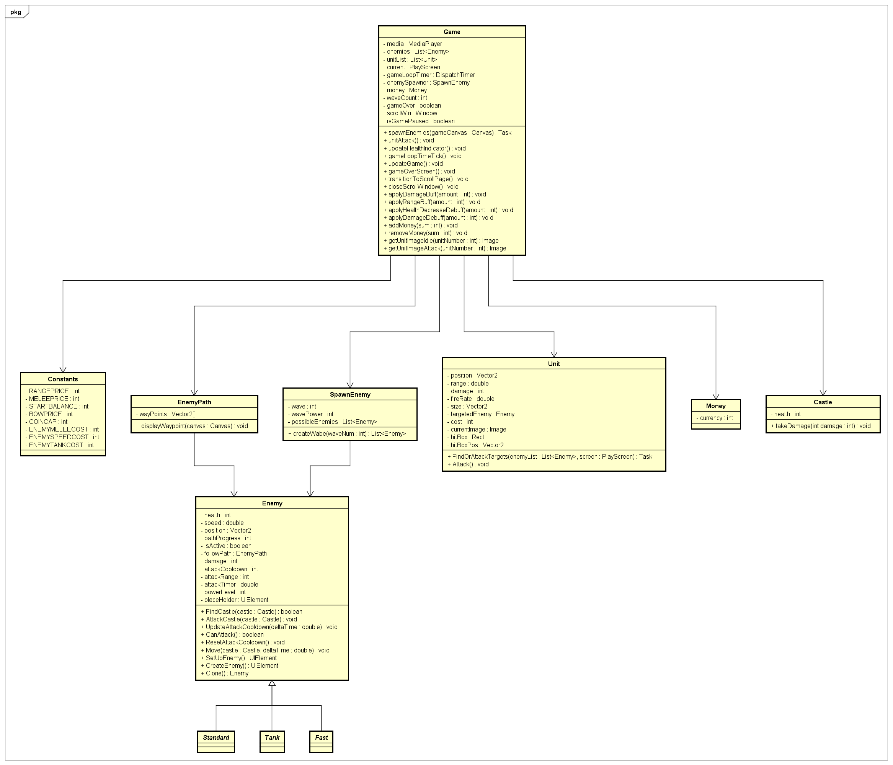

<h1> Shogun Standoff / Samurai Standoff </h1>

<h2> Introduction </h2>

In 16th century Japan during the Sengoku period, Daimyo X was a powerful lord tasked with stopping a skilled general named Sei Shapu and his army from conquering his castle. X's forces prepared for battle, knowing that failure would result in the execution of X's fiancée Yumi. After fighting over 100 waves of enemies, Taro emerged victorious and rescued Yumi. The shogun had no choice but to release her unharmed, and X married her in a grand wedding. Taro was hailed as a hero among his people for his bravery and cunning.

<h3> Game Concept </h3>
Shogun Stand is a 2D tower defense game that offers engaging gameplay mechanics deeply rooted in Japanese mythology. Players will strategically build, and deploy various attack units inspired by historical Japanese warriors, such as samurai, archers, and ninjas, to fend off waves of mythical enemies including Yokai, Oni, and Tengu.

The game is based on the arcade style, that means if the player's health is 0,
then he has to start the game all over again.

The game features a diverse array of defense towers, each with unique abilities that allow the player to tackle the challenge in different ways.

Players must carefully select the optimal combination of units and towers to exploit enemy weaknesses and synergize with their own strategy.

During gameplay, players will face intense enemy fights that challenge their tactical skills and resource management. 

After defeating 5 waves of enemies, players are rewarded with a buff item to strengthen their defenses and a debuff item which will offer them an advantage over the tough enemies.
Shogun Standof also incorporates a progression system where players can unlock new units, towers, and abilities, allowing them to develop their own unique playstyles.

Embrace the challenge and test your strategic prowess in Shogun Stand, where captivating Japanese elements and dynamic game mechanics come together to create an unforgettable tower defense adventure

The game is developed using .NET 6 and no game engine. UI-framework used is WinUI3.

<h3> What is a Tower Defense game? </h3>
The tower defense genre is a subgenre of strategy video games that revolves 
around defending a designated area, typically a base or a path, from waves
of incoming enemies. 
Players strategically place various types of defensive structures, 
often referred to as "towers," along the enemies' path to obstruct, damage, or 
eliminate them before they reach their objective.
Each tower has unique abilities, strengths, and weaknesses, requiring players 
to carefully plan their strategy and make tactical decisions to counter different 
enemy types. As players progress, they earn in-game resources to upgrade or purchase 
new towers, enhancing their defenses against increasingly challenging enemy waves.
Tower defense games are known for their addictive gameplay, strategic depth, 
and often for their distinctive visual styles.

<h3> Art style and aesthetics Game world and level design </h3>

The game will feature pixelated graphics, but not simplified it should leave much to interpret to the user but give
enough information to tell the user the story, setting, game style, and most importantly, what's going on
while providing textures which are easy on performance which will allow many units to appear on screen without having
to render many highly complex enemies.

<h4>Art examples:</h4>

  
   
  

The game aesthetic will be a fictional version of the japanese sengoku, edo and meiji eras. This gives the game that 
cultural japanese vibe which the game will take place in. (See more info in appendix)

The world and level design being the same will feature a standard style of japanese forest. This can include things
such as rivers, cherry blossom trees and a handful of traditional architectures. The level will contain a winding path on which
enemies will pass to reach your castle.

  
   
  

<h3> Story and Narrative </h3>

Shogun Stand embraces Japanese thematics to offer players an immersive and culturally rich gaming experience. By incorporating elements of Japanese mythology, folklore, and history, the game transports players to a captivating world teeming with legendary creatures and iconic warriors. This unique setting not only enhances the game's visual appeal but also allows players to explore and appreciate the depth and nuances of Japanese culture while engaging in strategic and challenging gameplay, setting Shogun Stand apart from other tower defense games.
<h4> Unit Concept </h4>

Dual Swordsman - Miyamoto Musashi

<h4>Samurai - Tomoe Gozen </h3>

<h3> Main Screen </h3>

<h4> Main screen when hovering on the options </h4>

<h3> Game screen </h3>

Samurai standing on the side of the road ready for the enemy units to pass through and attack
the base.

<h3> Buff/debuff selection screen </h3>

After having defeated a boss, a player can choose a buff and a debuff to alter gameplay.

<h3> Game Mechanics </h3>

<h4> Waves </h4>
Waves or Rounds are the main challenge of the game and the main source of income.
Each wave consists of a number of enemies that spawn at a certain time, and every 5 waves a player gets access to a scroll.
The wave ends when all enemies are dead.
The next wave starts after a certain amount of time has passed or when the payer presses a button to continue (like in the case of a scroll).

<h4> Currency </h4>
The player will be able to acquire gold by killing enemies. The amount of gold acquired depends on the type of enemy killed.
The player will be able to spend the gold on placing down units.

<h4> Scrolls </h4>
Scrolls are another way for the player's units to become stronger.
After every 5th wave, the player will be presented with a choice of 4 scrolls.
Each scroll will have a different effect, either on the player's units or the enemies.

<h3> Game Progression </h3>

As the game progresses, the waves will become stronger and the player will have to strategically buy and place more units to keep up.

# Class Diagram

# Development Timeline 

## Pre-Production (Weeks 1-2)

- **Week 1**: Concept development, initial game design document, and team formation
- **Week 2**: Research and planning (game mechanics, art style, audio, and platform requirements)

## Production (Weeks 3-7)

### Art and Audio

- **Week 3-4**: Create character models, animations, and environment assets
- **Week 5**: Design UI elements, including menus, HUD, and in-game prompts
- **Week 6**: Compose music tracks, sound effects, and implement audio

## Programming

- **Week 3-4**: Implement core game mechanics, enemy AI, tower functionality, and pathfinding
- **Week 5**: Develop basic level design and progression system
- **Week 6**: Implement player data management and integrate art and audio assets
- **Week 7**: Implement UI and menus, create a basic tutorial level (if applicable)

## Testing and Polishing (Weeks 8-9)

- **Week 8**: Internal playtesting, bug fixing, and gathering feedback
- **Week 9**: Final bug fixes, optimizations, polish, and prepare for release

# Test Plan

This chapter describes the test cases to validate the final product.

### 1. Start Screen -> Pass

| Step | Action             | Expected Results          |Actual Results|
|------|--------------------|---------------------------|-----|
| 1    | Press start button | Change scene. Game starts | Music plays on the main menu. Game starts|
| 2    |  | Player starts with 500 Coins|500 coins are visible |

### 2. Start Executable -> Pass

| Step | Action             | Expected Results          |Actual Results|
|------|--------------------|---------------------------|-----|
| 1    | Open executable file | Game application opens | Game opens up|

### 3. Buff/debuff screen -> Pass (defect)

| Step | Action             | Expected Results          |Actual Results|
|------|--------------------|---------------------------|-----|
| 1    | Progress in the game for 5 waves | Buff/debuff screen pops-up |After wave 5 buff/debuff screen pops up over the game screen|
| 2    | Select a single option and click it | Buff/debuff screen closes, buff/debuff applied|Screen closes, effects applied. However, after the screen closes, units' attack animation continues to play with no enemy in sight. Behaviour is fixed, when it attacks an enemy|

### 4. Game pause -> Fail

| Step | Action             | Expected Results          |Actual Results|
|------|--------------------|---------------------------|---|
| 1    | Press "Escape" key | Game paused | Game doesn't pause, functionality not implemnted |
| 2    | Press "Escape" key again  | Game unpaused | N/A |

### 5. Units -> Pass

| Step | Action             | Expected Results          |Actual Results|
|------|--------------------|---------------------------|--------------|
| 1    | Choose a unit from unit panel and drag and drop it on to the play screen | Money deducted, unit appears on game field, idle animation displayed|UNit gets placed, money deducted|
| 2    | Wait for enemy to come to unit's attack range  | Enemy gets damaged, enemy HP deducted, attack animation displayed |Enemies get killed, animation plays out|

### 5.1 Units Purchase Check -> Pass

| Step | Action             | Expected Results          |Actual Results|
|------|--------------------|---------------------------|--------------|
| 1    | Buy 5 melee units to spend 500 coins| Coin counter goes to 0, units placed | Coins deducted, units placed on the game field|
| 2    | Try to buy one more melee unit| Unit doesn't appear on the screen  | Unit didn't appear on the screen|

### 6. Castle (Player) damage -> Pass

| Step | Action             | Expected Results          |Actual Results|
|------|--------------------|---------------------------|--------------|
| 1    | Start a game and wait for enemies to come near the castle and attack | Castle (Player) HP get reduced |HP gets reduced, HP bar shows it|
| 2    | Wait for the HP to go to 0  | Game over screen displayed. Game stops | Game over screen displayed, game stopped, a sound is played|

### 7. Resizable Window -> Fail
| Step | Action             | Expected Results          |Actual Results|
|------|--------------------|---------------------------|--------------|
| 1    | Start a game | Game starts in full screen mode |Game starts in full screen |
| 2    | Try to resize the window by dragging its corner  | Game field (path, backgound) scales | Game field doesn't stretch|

### 8. Game music & Sounds -> Pass

| Step | Action             | Expected Results          |Actual Results|
|------|--------------------|---------------------------|--------------|
| 1    | Open the game | Music plays in the main menu |Music plays in the main menu |
| 2    | Press play  | Music changes as the game starts | Music changes as the game starts|
| 3    | Wait for the enemies to kill the tower  | Game end screen is shown, "Game over" sound is played | "Game over" sound is played, screen changed|

### 9. Unit Animation -> Pass

| Step | Action             | Expected Results          |Actual Results|
|------|--------------------|---------------------------|--------------|
| 1    | Start the game and place down 1 melee unit, 1 archer unit | Units displayed on the field in an idle pose  |Units stand in an idle pose, money subtracted  |
| 2    | Wait for unit to attack an enemy  | Character appropriate attack animation plays | attack animation plays|
| 3    | Wait for the unit to kill the enemy, or for the enemy to leave the unit's range of attack  | Unit goes back to the idle pose | Unit goes back to idle pose|

### 10. Enemy path following -> Pass
| Step | Action             | Expected Results          |Actual Results|
|------|--------------------|---------------------------|--------------|
| 1    | Start the game and wait to wave 1 enemies to spawn | Enemies appear on screen  |Enemies appear on screen  |
| 2    | Wait for the enemy to start moving  | Enemies follow the dirt path to the castle (player) | Enemies follow the path|
| 3    | Wait for the enemy to reach the castle  | Enemy stops, when it reaches the castle | Enemies stop near the castle|

# Project Team Members

1. **Mathew Shardin** (Project Leader)  
   Email: mathew.shardin@student.nhlstenden.com  
   The role of a Project Leader is to guide and lead the rest of the team to a better outcome and to a more successful result of the project, by explaining the details of every task that needs to be achieved and giving them feedback on their results to improve. 

2. **Miroslav Penchev** (Secretary)  
   Email: miroslav.penchev@student.nhlstenden.com  
   The purpose of Minutes is to have notes on every single important detail when we are gathering information in meetings with the clients or in team meetings which will guide us on what task needs to be done.

3. **Dimitri Vastenhout** (Co-Team Leader)  
   Email: dimitri.vastenhout@student.nhlstenden.com  
   The role of the Co-leader is to take the role of the team leader when the leader is not available.

4. **Teodor Folea** (Quality Control)  
   Email: teodor.folea@student.nhlstenden.com   
   The role of quality control is to establish and ensure a high quality of work is produced and delivered by the team in regard to documentation and software.

5. **Costache Alin** (Minutes taker)  
   Email: alin.costache@student.nhlstenden.com   
   A minute taker oversees taking the minutes of the meeting. These minutes are required to provide a formal account of who was at the meeting, what was discussed, what actions were agreed upon, and who would carry out these actions.

<h1>Moscow Analysis</h1>

| Must Have                                                             	                                 | Could Have                         	| Should Have                                            	                                     |
|---------------------------------------------------------------------------------------------------------|------------------------------------	|----------------------------------------------------------------------------------------------|
| A useable menu screen                                                 	                                 | Boss enemies                       	| Animations and textured units                          	                                     |
| A defeat screen with the option of  restarting or going back to menu. 	                                 | Different difficulty modes         	| Sound effects on certain events                        	                                     |
| A game screen with a background and UI elements                                                       	 | Resizable window                   	| Runes gameplay system to buff units and debuff enemies 	                                     |
| Enemies that move down the path                                       	                                 | Cutscenes or short movies, a story 	| Multiple units with different strengths                	                                     |
| Units that can attack and kill enemies                                	                                 |                                    	| Scroll Page that displays the runes                                                    	     |
| Enemies grant gold on their death                                     	                                 |                                    	| 	                                                                                            |
| Placeable units at the expense of gold                                	                                 |                                    	| 	                                                                                            |
| Enemies show up in waves                                              	                                 |                                    	| 	                                                                                            |

   
<h1>Appendix</h1>

<h3>Japanese Time Periods</h3>

<h4>Sengoku Period</h4>

The sengoku jidai (Warring states era) takes place during most of the 15th and 16th century.
This period consisted of many small and large clans vying to take control of territory.

<h4>Edo Period</h4>

The edo jidai, ranging from 1603 to 1867. Coming directly after the warring states era, the country was unified
by the three great unifiers of Japan (In order: Oda Nobunaga, Toyotomi Hideyoshi, Tokugawa Ieyasu), which started this era. The edo
period brought 250 years of stability, economic growth, arts and culture.

<h4>Meiji Restoration</h4>

The end of the edo period due to an alliance of two reformists, which brought the power back to
the emperor (the shogunate had ruled Japan for the edo period). The emperor opened up Japan after its long
isolationist period, this caused an inflow of new technology and culture. This was the most important step into modernization of Japan.

<h1>Work Cited</h1>

Wikipedia contributors. (2023). Sengoku period. Wikipedia. https://en.wikipedia.org/wiki/Sengoku_period

Wikipedia contributors. (2023b). Edo period. Wikipedia. https://en.wikipedia.org/wiki/Edo_period

Wikipedia contributors. (2023b). Meiji Restoration. Wikipedia. https://en.wikipedia.org/wiki/Meiji_Restoration

Wikipedia contributors. (2023a). Japanese architecture. Wikipedia. https://en.wikipedia.org/wiki/Japanese_architecture
